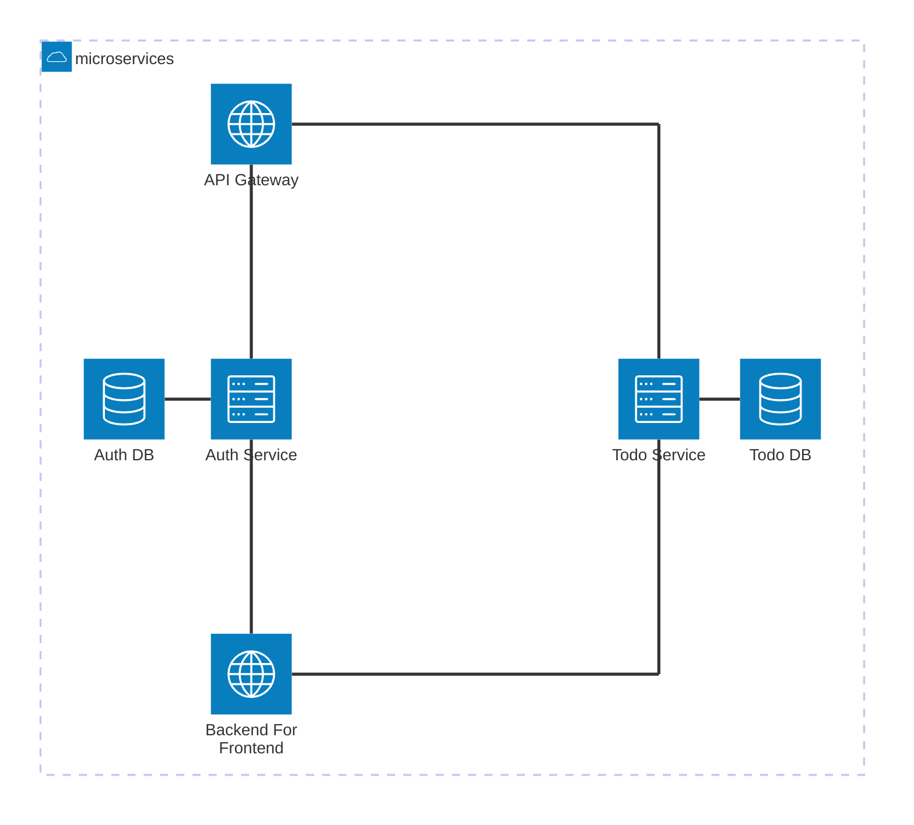

# API Key Architecture

This project implements the operation of API Keys in a microservices architecture. API authorization and authentication are handled through an API Gateway, allowing backend services to focus on their respective domains. Both the API Gateway and Backend For Frontend are implemented using [KrakenD](https://www.krakend.io/), while the backend services are built with [NestJS](https://nestjs.com/).



## Introduction

This project is designed around a Todo App, where each user can create, read, update, and delete their own Todos. Users can generate API Keys to manage their Todos and access their user information.

### Auth Service

The Auth Service provides the following APIs for access by the API Gateway or Backend For Frontend:

* `[POST] /api/users`: Create user information, also known as registration.
* `[GET] /api/users/:id`: Retrieve user information, requires the authenticated user ID to be passed in the header `x-user`.
* `[POST] /api/users/login`: User login, returns the information needed to generate the JWT.
* `[POST] /api/api-keys`: Create an API Key, requires the authenticated user ID to be passed in the header `x-user`.
* `[POST] /api/api-keys/validate`: Validate if the API Key is valid.

### Todo Service

The Todo Service provides the following APIs for access by the API Gateway or Backend For Frontend:

* `[POST] /api/todos`: Create a Todo, requires the authenticated user ID to be passed in the header `x-user`.
* `[GET] /api/todos/:id`: Retrieve a specific Todo, requires the authenticated user ID to be passed in the header `x-user`.
* `[PATCH] /api/todos/:id`: Update a specific Todo, requires the authenticated user ID to be passed in the header `x-user`.
* `[DELETE] /api/todos/:id`: Delete a specific Todo, requires the authenticated user ID to be passed in the header `x-user`.

### Backend For Frontend

The Backend For Frontend is the backend used by the frontend of the Todo App. Although the frontend is not implemented in this project, tools like Postman can be used to simulate the scenario where the frontend calls the Backend For Frontend. The Backend For Frontend provides user registration and login functionality. By including the issued JWT in the `Authorization` header, users can access Todo and User-related APIs. Below are the APIs provided by the Backend For Frontend:

* `[POST] /users/signup`: User registration.
* `[POST] /users/signin`: User login, returns an `access_token`. By including this JWT as a Bearer Token in the `Authorization` header, users can access Todo and User resources.
* `[POST] /api-keys`: Create an API Key, with the option to specify the access scope. Assignable roles include `todo:reader`, `todo:writer`, `user:reader`, and `admin`. JWT is required for access.
* `[GET] /users/{userId}`: Retrieve user information, JWT required.
* `[POST] /todos`: Create a Todo, JWT required.
* `[GET] /todos/{todoId}`: Retrieve a specific Todo, JWT required.
* `[PATCH] /todos/{todoId}`: Update a specific Todo, JWT required.
* `[DELETE] /todos/{todoId}`: Delete a specific Todo, JWT required.

### API Gateway

The API Gateway provides User and Todo-related APIs for API Key holders to access. Below are the APIs provided by the API Gateway:

* `[GET] /api/v1/users/{userId}`: Retrieve user information. Only API Keys with "read User resources" permission can access this API.
* `[GET] /api/v1/todos/{todoId}`: Retrieve a specific Todo. Only API Keys with "read Todo resources" permission can access this API.
* `[POST] /api/v1/todos`: Create a Todo. Only API Keys with "write Todo resources" permission can access this API.
* `[PATCH] /api/v1/todos/{todoId}`: Update a specific Todo. Only API Keys with "write Todo resources" permission can access this API.
* `[DELETE] /api/v1/todos/{todoId}`: Delete a specific Todo. Only API Keys with "write Todo resources" permission can access this API.

## Getting Started

> **Notice**：Before starting the project, please ensure that [Docker](https://www.docker.com/) and [Docker Compose](https://docs.docker.com/compose/) are installed in your environment.

This project is managed using [Nx](https://nx.dev/). Before running the project, please install the required dependencies using the following command.

```bash
$ npm install
```

After installation, some initial setup is required. First, build the Docker image for `todo-service` using the following command.

```bash
$ npx nx run todo-service:docker-build
```

And then, build the Docker image for `auth-service` using the following command.

```bash
$ npx nx run auth-service:docker-build
```

Now, we need to generate the JWK information for JWT authentication in the Backend For Frontend. Use the following command to generate the public and private keys and convert them into `jwks.json` and `public.json`.

```bash
$ npx nx run backend-for-frontend:generate-jwk-public
```

Next, we need to copy the `kid` from `public.json` into `krakend.json`. Please paste it on line `39`.

> **Hint**: The file to be modified is `krakend.json` located under `backend-for-frontend`.

```json
{
  // ...
  "kid": "<GENERATED_KID>"
}
```

Next, we need to add `.env` file under `apps/auth-service`.

```plaintext
PORT=3333
MONGO_URI=mongodb://mongo:27017/auth-service

TOKEN_AUDIENCE=http://backend-for-frontend:8080
TOKEN_ISSUER=http://auth-service:3333
```

Next, we need to add `.env` file under `apps/todo-service`.

```plaintext
PORT=3333
MONGO_URI=mongodb://mongo:27017/todo-service
```

Finally, we need to compile the API Gateway plugin for API Key validation. Use the following command to compile the plugin.

```bash
$ npx nx run api-gateway:build-plugin:api-key-validator
```

Now, use the following command to serve services.

```bash
$ docker compose -f 'docker-compose.yml' up -d --build
```
